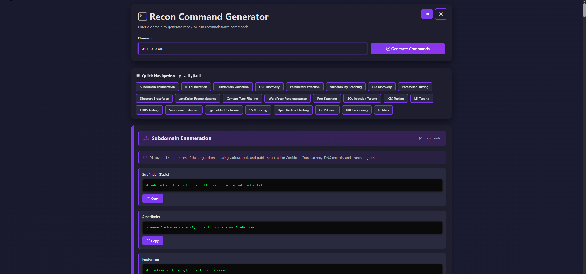

# Advanced-Recon-Command 🔥

<div align="center">




**A powerful web-based reconnaissance command generator for bug bounty hunters and penetration testers**

[Features](#-features) • [Installation](#-installation) • [Usage](#-usage) • [Contributing](#-contributing)

</div>

---

## 📋 Table of Contents

- [Overview](#-overview)
- [Features](#-features)
- [Requirements](#-requirements)
- [Installation](#-installation)
- [Usage](#-usage)
- [Command Categories](#-command-categories)
- [API Keys Configuration](#-api-keys-configuration)
- [Project Structure](#-project-structure)
- [Contributing](#-contributing)
- [Disclaimer](#-disclaimer)
- [License](#-license)

## 🎯 Overview

**Advanced-Recon-Command** is a comprehensive Flask web application designed to streamline the reconnaissance phase of bug bounty hunting and penetration testing. Simply enter a target domain, and the application automatically generates **100+ ready-to-run reconnaissance commands** organized into 24 categories.

### Why Advanced-Recon-Command?

- ⚡ **Fast & Efficient**: Generate all recon commands in seconds
- 🎨 **Beautiful UI**: Modern, responsive design with dark mode support
- 📋 **Copy & Paste Ready**: One-click copy for each command
- 🔑 **API Key Management**: Secure local storage for API keys
- 🧭 **Quick Navigation**: Jump to any category instantly
- 📚 **Comprehensive**: Covers all aspects of reconnaissance

## ✨ Features

### Core Features
- ✅ **Single Domain Input**: Enter domain once, generate all commands
- ✅ **100+ Commands**: Pre-configured commands for all recon phases
- ✅ **24 Categories**: Organized by purpose (Subdomain Enum, URL Discovery, Vulnerability Scanning, etc.)
- ✅ **Auto Domain Replacement**: Automatically replaces domain placeholders in all commands
- ✅ **API Key Integration**: Secure API key management with auto-replacement
- ✅ **Copy to Clipboard**: One-click copy for each command
- ✅ **Dark Mode**: Beautiful dark theme with smooth transitions
- ✅ **Quick Navigation**: Sticky navigation bar for easy category access
- ✅ **Category Descriptions**: Helpful descriptions for each category
- ✅ **Responsive Design**: Works perfectly on desktop, tablet, and mobile

### Command Categories
1. **Subdomain Enumeration** (20 commands)
2. **IP Enumeration** (5 commands)
3. **Subdomain Validation** (4 commands)
4. **URL Discovery** (5 commands)
5. **Parameter Extraction** (5 commands)
6. **Vulnerability Scanning** (2 commands)
7. **File Discovery** (2 commands)
8. **Parameter Fuzzing** (2 commands)
9. **Directory Bruteforce** (3 commands)
10. **JavaScript Reconnaissance** (5 commands)
11. **Content Type Filtering** (2 commands)
12. **WordPress Reconnaissance** (1 command)
13. **Port Scanning** (3 commands)
14. **SQL Injection Testing** (3 commands)
15. **XSS Testing** (9 commands)
16. **LFI Testing** (5 commands)
17. **CORS Testing** (5 commands)
18. **Subdomain Takeover** (1 command)
19. **.git Folder Disclosure** (1 command)
20. **SSRF Testing** (12 commands)
21. **Open Redirect Testing** (7 commands)
22. **GF Patterns** (6 commands)
23. **URL Processing** (3 commands)
24. **Utilities** (2 commands)

## 📦 Requirements

- **Python**: 3.7 or higher
- **pip**: Python package manager
- **Modern Web Browser**: Chrome, Firefox, Safari, or Edge

## 🚀 Installation

### Step 1: Clone the Repository

```bash
git clone https://github.com/0xRespect/Advanced-Recon-Command.git
cd Advanced-Recon-Command
```

### Step 2: Install Dependencies

```bash
pip install -r requirements.txt
```

Or if you prefer using a virtual environment (recommended):

```bash
# Create virtual environment
python -m venv venv

# Activate virtual environment
# On Windows:
venv\Scripts\activate
# On Linux/Mac:
source venv/bin/activate

# Install dependencies
pip install -r requirements.txt
```

### Step 3: Run the Application

```bash
python app.py
```

The application will start on `http://localhost:5000`

### Alternative: Using Flask CLI

```bash
export FLASK_APP=app.py
flask run
```

## 💻 Usage

### Basic Usage

1. **Start the Application**
   ```bash
   python app.py
   ```

2. **Open Your Browser**
   Navigate to: `http://localhost:5000`

3. **Enter Domain**
   - Type your target domain (e.g., `example.com`)
   - Click "Generate Commands" or press Enter

4. **Copy Commands**
   - Browse through categories
   - Click "Copy" button next to any command
   - Paste into your terminal

### Advanced Features

#### API Keys Configuration

1. Click the **API Keys** button (top right)
2. Enter your API keys:
   - VirusTotal API Key
   - GitHub Token
   - Shodan API Key
   - ASN Number
   - WPScan API Token
3. Click "Save All Keys"
4. Keys are stored locally in your browser (never sent to server)

#### Quick Navigation

- Use the sticky navigation bar at the top
- Click any category to jump directly to it
- Smooth scroll animation for better UX

#### Dark Mode

- Click the moon/sun icon (top right)
- Your preference is saved automatically

## 🔑 API Keys Configuration

The following commands require API keys (configured in `/api-keys` page):

| Service | Placeholder | Required For |
|---------|------------|--------------|
| VirusTotal | `[api-key]` | Domain Siblings, IP Enumeration |
| GitHub | `[github_token]` | GitHub Subdomains |
| Shodan | `YourAPIKEY` | Shosubgo (Subdomain Enumeration) |
| ASN | `[asnno]` | Amass Intel (ASN) |
| WPScan | `<here>` | WordPress Reconnaissance |

**Note**: API keys are stored locally in your browser's localStorage. They are never transmitted to any server.

## 📁 Project Structure

```
Advanced-Recon-Command/
├── app.py                 # Flask application (main file)
├── requirements.txt       # Python dependencies
├── README.md             # This file
├── screenshots/          # Screenshots directory
│   └── UI.png           # Main UI screenshot
└── templates/
    ├── index.html       # Main page template
    └── api_keys.html   # API keys configuration page
```

## 🤝 Contributing

Contributions are welcome! Please feel free to submit a Pull Request.

1. Fork the repository
2. Create your feature branch (`git checkout -b feature/AmazingFeature`)
3. Commit your changes (`git commit -m 'Add some AmazingFeature'`)
4. Push to the branch (`git push origin feature/AmazingFeature`)
5. Open a Pull Request

### Areas for Contribution

- 🐛 Bug fixes
- ✨ New command templates
- 📝 Documentation improvements
- 🎨 UI/UX enhancements
- 🌐 Translations
- 🔧 Performance optimizations

## ⚠️ Disclaimer

**This tool is for authorized security testing only.**

- Always ensure you have proper authorization before conducting security assessments
- Use this information responsibly and ethically
- The authors are not responsible for any misuse of this tool
- Unauthorized access to computer systems is illegal

## 📄 License

This project is licensed under the MIT License - see the [LICENSE](LICENSE) file for details.

---

<div align="center">

**Made with ❤️ for the Bug Bounty Community**

⭐ Star this repo if you find it useful!

</div>
